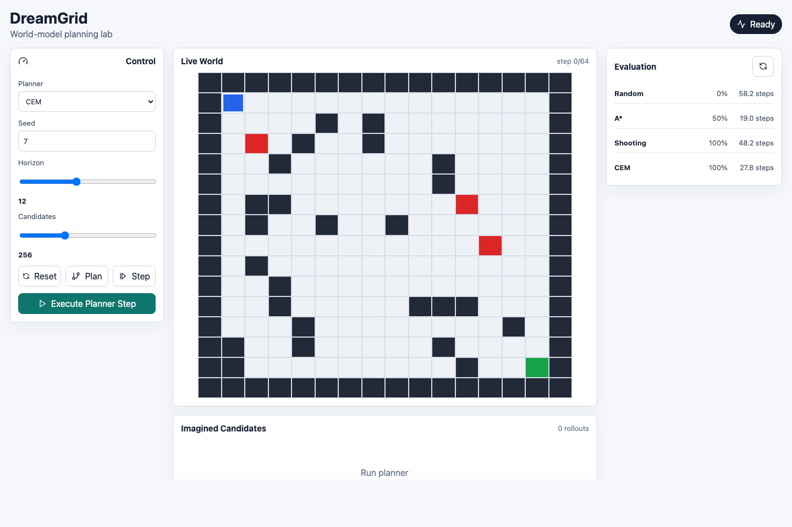
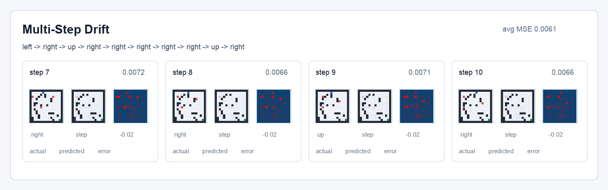

# DreamGrid

DreamGrid is a visual model-based planning project. It provides a 2D rescue environment, planner baselines, transition dataset generation, latent dynamics training, and a dashboard for inspecting episodes and planner behavior.

The codebase is structured as a reproducible research/engineering system: simulator, planners, dataset pipeline, model training, API, UI, tests, and documentation.



The repository contains:

- `backend/`: GridRescue environment, planners, dataset generation, model code, FastAPI service, and tests.
- `frontend/`: React dashboard for live episodes, imagined rollouts, and planner comparisons.
- `docs/`: research report, architecture notes, roadmap, and screenshots.

## Objective

Evaluate whether a compact visual dynamics model can learn useful transition predictions from a grid-rescue simulator and support rollout-based planning workflows.

The project is built around a deliberately small but inspectable setup:

- **Environment:** a seeded 2D rescue grid with walls, moving hazards, a goal, and sparse terminal rewards.
- **Dataset:** transition tuples of `(observation, action, next observation, reward, done)`.
- **Model:** a latent CNN dynamics model that predicts the next frame, reward, and terminal state.
- **Baselines:** random policy, A*, random-shooting MPC, and CEM-style planning.
- **Interface:** a dashboard for live state, planner controls, candidate rollouts, and evaluation metrics.

## Implementation Status

Implemented:

- Deterministic `GridRescueEnv` with RGB rendering and symbolic state.
- Random, A*, random-shooting, and CEM planners.
- Dataset generation and planner evaluation CLIs.
- FastAPI backend for episodes, planner calls, rollouts, and evaluation.
- React/Vite dashboard for the live grid and planner metrics.
- PyTorch latent world-model architecture and training script.
- Validation metrics and prediction contact-sheet export.

Limitations:

- Classical planners still use the true simulator for rollout scoring.
- Learned rollouts and learned MPC require PyTorch plus a local checkpoint.
- Oracle-vs-learned aggregate rollout metrics are still pending.

## Results Snapshot

Generated training artifacts are ignored by git except for the published Git LFS checkpoint. The latest recorded run produced:

| Artifact | Value |
| --- | --- |
| Dataset | `dataset_1000.npz` |
| Episodes | `1,000` |
| Transitions | `38,881` |
| Best trained checkpoint | `world_model_v3_50ep.pt` |
| Final frame MSE | `0.00393` |
| Final reward MAE | `0.01667` |
| Final done accuracy | `0.986` |
| Best validation loss epoch | `17` |

The trained checkpoint is tracked with Git LFS at `experiments/world_model_v3_50ep.pt`.

See [docs/RESEARCH.md](docs/RESEARCH.md) for methodology, results, and limitations.

## Model Inspection

The dashboard includes a multi-step drift view for comparing simulator frames, model predictions, and per-step error across imagined action sequences.



## Quick Start

Backend:

```bash
cd backend
python3 -m venv .venv
source .venv/bin/activate
pip install -e ".[dev]"
uvicorn dreamgrid.api:app --reload --port 8000
```

Add the `train` extra when you want to train the PyTorch latent world model.

Learned rollout endpoints and `learned_mpc` use `experiments/world_model_v3_50ep.pt` by default. Override it with:

```bash
export DREAMGRID_MODEL_PATH=/path/to/world_model.pt
```

Frontend:

```bash
cd frontend
npm install
npm run dev
```

Open the Vite URL and use the dashboard to generate an episode, step planners, and inspect imagined futures.

## Core Commands

Generate a transition dataset:

```bash
cd backend
python -m dreamgrid.dataset --episodes 200 --out ../experiments/dataset_200.npz
```

Train a latent world model:

```bash
cd backend
python -m dreamgrid.train \
  --dataset ../experiments/dataset_200.npz \
  --epochs 10 \
  --out ../experiments/world_model.pt \
  --sample-dir ../experiments/world_model_samples
```

Evaluate planners:

```bash
cd backend
python -m dreamgrid.evaluate --episodes 25 --grid-size 16
```

Evaluate learned rollout drift:

```bash
cd backend
python -m dreamgrid.evaluate --learned-rollouts --episodes 20 --rollout-horizons 1 3 5 10
```

Run API/backend tests:

```bash
cd backend
pytest
```

Build frontend:

```bash
cd frontend
npm run build
```

## Project Docs

- [Research report](docs/RESEARCH.md)
- [Architecture](docs/ARCHITECTURE.md)
- [Roadmap](docs/ROADMAP.md)
- [Contributing](CONTRIBUTING.md)
- [TODO](TODO.md)

Experiment datasets and sample images are ignored by git. The published checkpoint is stored with Git LFS; run `git lfs pull` if your clone does not download it automatically.
