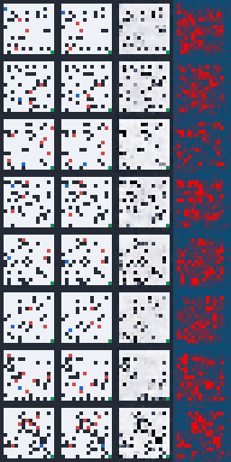
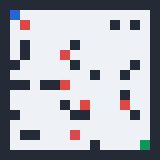

# DreamGrid Experiment Journal

This journal records the model and planner experiments that shaped the current checkpoint. Generated datasets, logs, metrics JSON, contact sheets, and checkpoints live under `experiments/` and are mostly ignored by git; this document keeps the durable summary.

## 2026-05-07: Planner-Optimized World Model

### Question

Can a compact visual world model support useful learned MPC planning, even if decoded frame predictions are imperfect?

### What Changed

- Generated a mixed 3,000-episode dataset across nominal and moving-hazard scenarios.
- Trained a 30-epoch weighted world model with loss weights:
  - frame: `1.0`
  - reward: `0.5`
  - done: `0.2`
- Promoted the best-validation checkpoint from epoch 12 as the default `experiments/world_model_v3_50ep.pt`.
- Tracked the promoted source checkpoint as `experiments/world_model_candidate_weighted_30ep_best.pt` through Git LFS for reproducibility.

The checkpoint was selected for planner behavior, not visual fidelity. The main result is lower learned MPC collision rates across all full held-out splits.

### Training Snapshot

| Metric | Value |
| --- | ---: |
| Dataset episodes | 3,000 |
| Dataset transitions | 104,958 |
| Best epoch | 12 |
| Best validation loss | 0.04116 |
| Best frame MSE | 0.01647 |
| Best reward MAE | 0.02715 |
| Best done accuracy | 0.9815 |

The contact sheet below shows rows of:

```text
current frame | target next frame | predicted next frame | error heatmap
```



### Held-Out Planner Result

Full benchmark: 25 episodes per split and scenario, comparing the previous default checkpoint against the weighted checkpoint.

| Split / Scenario | Default success | Weighted success | Default collision | Weighted collision |
| --- | ---: | ---: | ---: | ---: |
| validation / nominal | 0.48 | 0.60 | 0.12 | 0.08 |
| validation / moving hazards | 0.28 | 0.60 | 0.32 | 0.12 |
| validation / dense walls | 0.24 | 0.20 | 0.16 | 0.12 |
| test / nominal | 0.64 | 0.64 | 0.16 | 0.08 |
| test / moving hazards | 0.44 | 0.44 | 0.36 | 0.32 |
| test / dense walls | 0.28 | 0.60 | 0.20 | 0.08 |

Aggregate across all six split/scenario combinations:

| Metric | Previous default | Weighted checkpoint |
| --- | ---: | ---: |
| Learned MPC success rate | 0.393 | 0.513 |
| Learned MPC collision rate | 0.220 | 0.133 |
| Learned MPC average reward | -0.837 | -0.602 |
| Horizon-5 frame MSE | 0.0744 | 0.0807 |
| Horizon-5 reward MAE | 0.0680 | 0.2082 |
| Horizon-5 done accuracy | 0.972 | 0.792 |

### Interpretation

The weighted checkpoint is better for action selection:

- Success improves or ties in 5 of 6 full benchmark slices.
- Collision rate improves in all 6 slices.
- The largest wins are validation moving hazards and test dense walls.

The tradeoff is real:

- Multi-step decoded frames are worse.
- Reward MAE and done accuracy are worse at longer horizons.
- This is not the best checkpoint for visual rollout inspection.

The working inference is that learned MPC needs a latent state that ranks candidate futures better more than it needs crisp predicted pixels. The stronger reward/done losses made the latent dynamics more planner-useful while sacrificing visual fidelity.

### Replay Artifact

This replay shows a held-out moving-hazard failure case from the symbolic planner baseline, useful for understanding why timing hazards matter.



### Reproduction Commands

```bash
cd backend
python -m dreamgrid.dataset \
  --episodes 3000 \
  --scenarios nominal moving_hazards \
  --out ../experiments/dataset_mixed_3000.npz
```

```bash
python -m dreamgrid.train \
  --dataset ../experiments/dataset_mixed_3000.npz \
  --epochs 30 \
  --reward-loss-weight 0.5 \
  --done-loss-weight 0.2 \
  --out ../experiments/world_model_candidate_weighted_30ep.pt \
  --best-out ../experiments/world_model_candidate_weighted_30ep_best.pt \
  --metrics-out ../experiments/world_model_candidate_weighted_30ep_metrics.json \
  --sample-dir ../experiments/world_model_candidate_weighted_30ep_samples
```

```bash
python -m dreamgrid.evaluate --heldout \
  --planners cem learned_mpc \
  --episodes-per-split 25 \
  --splits validation test \
  --scenarios nominal moving_hazards dense_walls \
  --rollout-horizons 1 3 5 10 \
  --model-path ../experiments/world_model_candidate_weighted_30ep_best.pt \
  --out-json ../experiments/heldout_candidate_weighted_30ep_full.json \
  --out-csv ../experiments/heldout_candidate_weighted_30ep_full.csv
```

## Open Questions

- Can a multi-objective checkpoint selector preserve the planner gains while recovering visual rollout fidelity?
- Should learned MPC use separate scalar heads more directly instead of leaning on decoded visual features?
- Would periodic checkpointing and resume support make longer local training less fragile?
