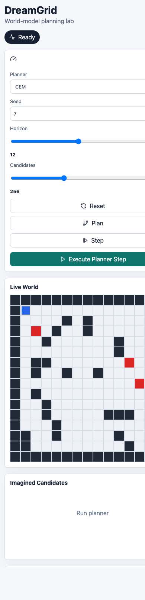

# DreamGrid Research Report

## Abstract

DreamGrid is a compact model-based planning system for studying learned visual dynamics. It generates episodes in a seeded 2D rescue world, trains a latent CNN dynamics model from transition tuples, and exposes planners plus diagnostics through a dashboard.

## Problem Setting

The task is a visual navigation problem. An agent starts near the upper-left of a grid, tries to reach a rescue target near the lower-right, and must avoid moving hazards and walls. Each step produces an RGB observation, a scalar reward, and a terminal flag.

This setup is small enough to inspect, but rich enough to expose core model-based planning problems:

- learning transition dynamics from pixels
- predicting terminal events and rewards
- measuring compounding rollout error
- comparing learned prediction against classical planning
- separating simulator planning from learned-model planning

## Method

### Environment

`GridRescueEnv` creates deterministic seeded maps with:

- static walls
- moving hazards
- an agent
- a goal
- five discrete actions: up, down, left, right, stay
- terminal events: goal, collision, timeout

The environment emits both a symbolic state for debugging and an RGB frame for visual model training.

### Dataset

The dataset generator records transition tuples:

```text
obs_t, action_t, obs_t+1, reward_t, done_t, episode_id, step, seed
```

The first full local dataset contains:

| Metric | Value |
| --- | ---: |
| Episodes | 1,000 |
| Transitions | 38,881 |
| Observation shape | 64 x 64 x 3 |
| Reward range | -1.0 to 1.0 |
| Terminal transitions | 1,000 |

### World Model

The model predicts the next observation, reward, and terminal state:

```text
image -> CNN encoder -> latent state
latent state + action -> dynamics model -> next latent state
next latent state -> decoder -> predicted next image
next latent state -> reward head
next latent state -> done head
```

This is deliberately a simple latent dynamics baseline. It is not a Dreamer/RSSM implementation yet.

### Planners

Implemented planners:

- **Random:** lower-bound baseline.
- **A\*:** symbolic shortest-path baseline using true grid state.
- **Random shooting MPC:** samples action sequences, simulates them, and executes the first action from the best sequence.
- **CEM planner:** iteratively biases action-sequence sampling toward high-scoring candidates.

Current planners use simulator rollouts. Learned-model rollout scoring is a planned extension.

## Results

The best recorded training run used `dataset_1000.npz` and trained for 50 CPU epochs.

| Metric | Value |
| --- | ---: |
| Final train loss | 0.00315 |
| Final validation loss | 0.02049 |
| Final frame MSE | 0.00393 |
| Final reward MAE | 0.01667 |
| Final done accuracy | 0.986 |
| Best validation loss | 0.01515 at epoch 17 |

The frame prediction error improved substantially compared with early checkpoints:

| Checkpoint | Epochs | Frame MSE |
| --- | ---: | ---: |
| `world_model_v2.pt` | 2 | 0.05650 |
| `world_model_v3_50ep.pt` | 50 | 0.00393 |

## Qualitative Evidence

Prediction contact sheets are exported during training. Each row shows:

```text
current frame | target next frame | predicted next frame | error heatmap
```

These artifacts are ignored by git because they are generated experiment outputs.

The dashboard screenshots below show the interactive planning interface.




## Limitations

- Learned rollout inspection and aggregate oracle-vs-learned metrics are API-backed.
- The training script currently saves the final checkpoint, not the best-validation checkpoint.
- PyTorch reported `mps False` on the training machine, so the 50-epoch run was CPU-only.
- The current model is a one-step latent CNN dynamics model, not a recurrent state-space model.
- Classical planners still exploit simulator truth; learned MPC is available as an explicit separate planner.

## Next Milestones

1. Save the best-validation checkpoint during training.
2. Compare learned-model MPC against simulator MPC, A*, and random baselines.
3. Evaluate on held-out map splits and moving hazard scenarios.
4. Export rollout GIFs, metrics tables, and failure cases.
